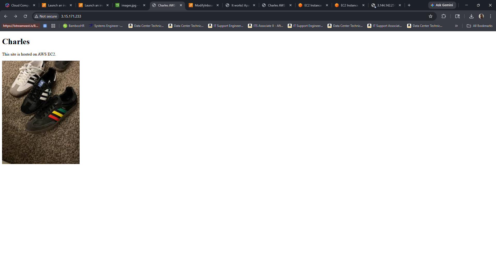
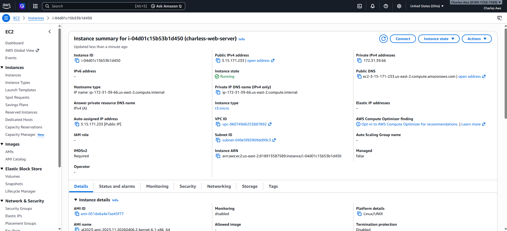
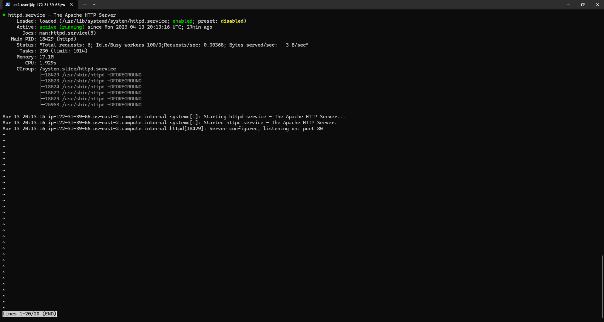
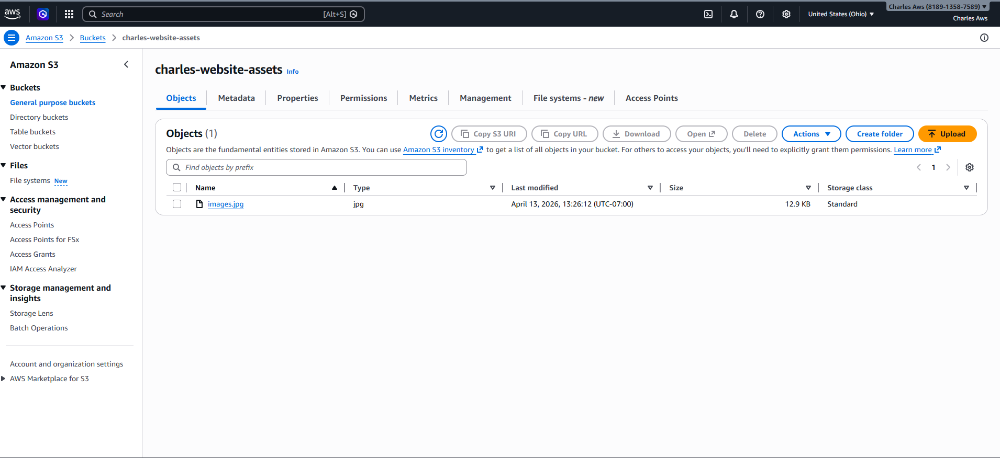

# AWS Website Deployment Project

## Overview
I deployed a live website using AWS EC2 and integrated S3 for image storage.

## What I did
- Launched an EC2 instance (Amazon Linux)
- Connected via SSH
- Installed and configured Apache web server
- Hosted a live website
- Created an S3 bucket and uploaded images
- Configured public access using bucket policies
- Connected S3 assets to the website

## Screenshots

### Live Website

### EC2 Instance Running

### SSH Terminal

### S3 Bucket

